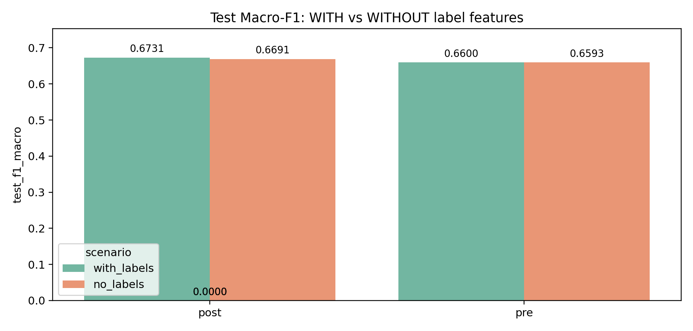
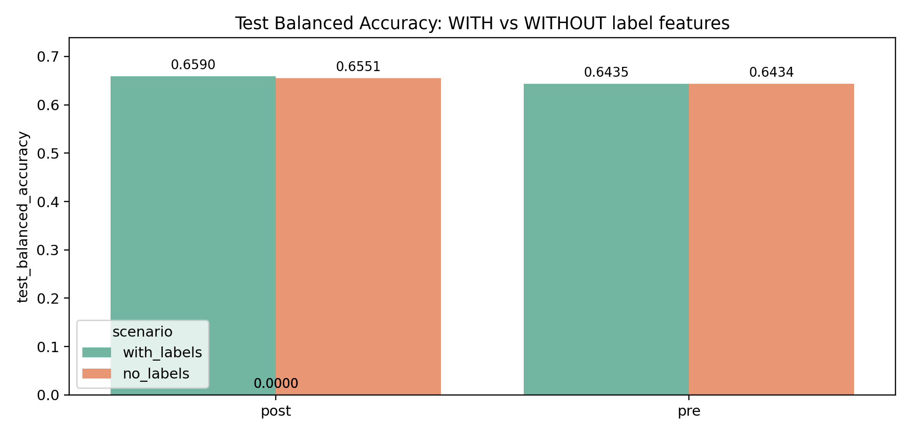

# Random Forest Comparison Report

This report compares **two experiment roots** to estimate the impact of using `CONT_label_*` features.

- **WITH label features scenario:** `with_labels`

- **WITHOUT label features scenario:** `no_labels`

---

## Main results (Test set)

| scenario    | set   |   n_features | search_method       |   time_min |   cv_f1_macro | best_balance   |   test_f1_macro |   test_bal_acc |
|-------------|-------|--------------|---------------------|------------|---------------|----------------|-----------------|----------------|
| with_labels | post  |          172 | full (GridSearchCV) |      86.98 |        0.6525 | none           |          0.6731 |         0.659  |
| with_labels | pre   |          163 | full (GridSearchCV) |      80    |        0.6302 | none           |          0.66   |         0.6435 |
| no_labels   | post  |           25 | full (GridSearchCV) |      81.77 |        0.6512 | none           |          0.6691 |         0.6551 |
| no_labels   | pre   |           16 | full (GridSearchCV) |      79.32 |        0.6351 | none           |          0.6593 |         0.6434 |

---

## PRE vs POST deltas (within each scenario)

| scenario    |   delta_post_minus_pre_test_f1_macro |   delta_post_minus_pre_test_bal_acc |
|-------------|--------------------------------------|-------------------------------------|
| no_labels   |                               0.0098 |                              0.0116 |
| with_labels |                               0.0131 |                              0.0155 |

---

## Impact of label features (WITH − WITHOUT)

Positive values indicate that adding `CONT_label_*` **improved** the metric.

| set   |   delta_test_f1_macro |   delta_test_bal_acc |
|-------|-----------------------|----------------------|
| post  |                0.004  |               0.0039 |
| pre   |                0.0007 |               0.0001 |

---

## Plots

---

## Best CV Macro-F1 by balancing strategy (per scenario)

| scenario    | strategy    |   post |    pre |
|-------------|-------------|--------|--------|
| with_labels | none        | 0.6525 | 0.6302 |
| no_labels   | none        | 0.6512 | 0.6351 |
| no_labels   | oversample  | 0.6402 | 0.6183 |
| with_labels | oversample  | 0.6398 | 0.6178 |
| with_labels | undersample | 0.6295 | 0.6086 |
| no_labels   | undersample | 0.6284 | 0.6076 |

